# Лабораторные работы

## Лабораторная работа 1

### Задание 1
```python
ime=input('Имя: ')
vozrast=int(input('Возраст: '))
print(f'Привет, {ime}! Через год тебе будет {vozrast+1}.')
```


### Задание 2
```python
a=(input('Число a: ')).replace(',','.')
b=(input('Число b: ')).replace(',','.')
sum=round((float(a)+float(b)),2)
avg=round((float(a)+float(b))/2,2)
print(f'Сумма = {sum} ; Среднее арифметическое = {avg}')
```


### Задание 3
```python
price = float(input('Введите цену: '))
disc = float(input('Введите скидку: '))
vat = float(input('Введите НДС: '))
base = price * (1 - disc / 100)
vat_amount =base * (vat / 100)
total = base + vat_amount
print(f'База после скидки:{base:.2f} Р')
print(f'НДС:{vat_amount:.2f} Р')
print(f'Итого к оплате:{total:.2f} Р')
```


### Задание 4
```python
vrema=int(input('Введите кол-во минут '))
chas=vrema//60
print(f' Результат перевода: {chas}:{vrema-(chas*60)}')
```


### Задание 5
```python
fio=input('ФИО: ')
inic=''
dl=0
x=fio.split()
for i in range(0,len(x)):
    inic=inic+x[i][0]+'.'
    dl=len(x[i])+dl
print(f'Инициалы: {inic[:-1]}')
print(f'Длина (символов): {dl+2}')
```

## Лабораторная работа 2
### Задание 1.1
```python
def min_max(nums:list[float|int])->tuple[float|int, float| int]:
    if len(nums)==0:
         return ValueError
    mi=100000000000000000
    ma=-100000000000000000
    for i in range(0,len(nums)):
        if nums[i]<mi:
            mi=nums[i]
        if nums[i]>ma:
            ma=nums[i]
    return tuple([mi, ma])
print(min_max([1.5, 2, 2.0, -3.1]))
```


### Задание 1.2
```python
def unique_sorted(nums:list[float|int])->list[float|int]:
    return sorted(set(nums))
print(unique_sorted([3,1,2,1,3]))
```


### Задание 1.3
```python
def flatten(mat:list[list| tuple])->list:
    array=list()
    for arr in mat:
        if not(isinstance(arr,tuple) or isinstance(arr,list)):
            return TypeError
        for member in arr:
            array.append(member)
    return array
print(flatten([[1,2],[3,4]]))
```


### Задание B.1
```python
def transpose(mat:list[list[float|int]])->list[list]:
    if len(mat)==0:
        return []
    if any(len(mat[0])!=len(mat[i]) for i in range(len(mat))):
        return ValueError
    new=[[0 for j in range(len(mat))] for i in range(len(mat[0]))]
    for i in range(len(mat)):
        for j in range(len(mat[i])):
            new[j][i]=mat[i][j]
    return new
print(transpose([[1,2],[3,4]]))
```


### Задание B.2
```python
def row_sums(mat:list[list[float|int]])->list[float]:
    if any(len(mat[0]) != len(mat[i]) for i in range(len(mat))):
        return ValueError
    array=list()
    for arr in mat:
        array.append(sum(arr))
    return array
print(row_sums([[1,2,3], [4,5,6]]))
```


### Задание B.3
```python
def col_sums(mat:list[list[float|int]])->list[float]:
    if any (len(mat[0])!=len(mat[i]) for i in range (len(mat))):
        return ValueError
    array=list(0 for i in range(len(mat[0])))
    for i in range(len(mat)):
        for j in range(len(mat[i])):
            array[j]+=mat[i][j]
    return array
print(col_sums([[1,2,3],[4,5,6]]))
```


### Задание C
```python
def format_record(rec:tuple[str,str,float]):
    name_data=rec[0].strip().split()
    if len(name_data)>2:
        surname,name,otchestvo=rec[0].strip().split()
        new_name_data=f'{surname[0].upper()}{surname[1:]} {name[0].upper()} {otchestvo[0].upper()}'
    elif len(name_data)==2:
        surname, name = rec[0].strip().split()
        new_name_data = f'{surname[0].upper()}{surname[1:]} {name[0].upper()} '
    elif len(name_data)==1:
        surname,  = rec[0].strip().split()
        new_name_data = f'{surname[0].upper()}{surname[1:]} '
    else:
        return ValueError
    group=rec[1].strip()
    if group=='':
        return ValueError
    try:
        gpa=float(rec[2])
    except Exception as _:
        return TypeError
    return f'{new_name_data}, гр. {group}, GPA {gpa:.2f}'
print(format_record(("Петров Пётр Петрович", "IKBO-12", 5.0)))

```

## Лабораторная работа 3

### Задание А
```python
import re

def normalize(text: str, *, casefold: bool = True, yo2e: bool = True) -> str:
    if casefold:
        text = text.casefold()
    if yo2e:
        text = text.replace('Ё', 'Е').replace('ё', 'е')
    text = ' '.join(text.strip().split())
    return text
print(normalize("Hello\r\nWorld"))
print(normalize("ёжик, Ёлка"))
print(normalize("Hello\r\nWorld"))
print(normalize("  двойные   пробелы  "))

def tokenize(text: str) -> list[str]:
    pattern = r'\w+(?:-\w+)*'
    tokens = re.findall(pattern, text)
    return tokens
print(tokenize("привет мир"))
print(tokenize("hello,world!!!"))
print(tokenize("по-настоящему круто"))
print(tokenize("2025 год"))
print(tokenize("emoji 😀 не слово"))
def count_freq(tokens: list[str]) -> dict[str, int]:
    freq = {}
    for token in tokens:
        freq[token] = freq.get(token, 0) + 1
    return freq

def top_n(freq: dict[str, int], n: int = 5) -> list[tuple[str, int]]:
    sorted_items = sorted(
        freq.items(),
        key=lambda x: (-x[1], x[0])
    )
    return sorted_items[:n]
print(top_n(count_freq(["a","b","a","c","b","a"]),n=2))
print(top_n(count_freq(["bb","aa","bb","aa","cc"]),n=2))
```


### Задание В
```
import sys
import os
sys.path.append(os.path.join(os.path.dirname(__file__), '..'))

from lib.text import normalize, tokenize, count_freq, top_n

# Чтение всего ввода из stdin
text = sys.stdin.readline()

# Нормализация текста
normalized_text = normalize(text)

# Токенизация
tokens = tokenize(normalized_text)

# Подсчет статистики
total_words = len(tokens)
freq_dict = count_freq(tokens)
unique_words = len(freq_dict)
top_words = top_n(freq_dict, 5)

# Вывод результатов
print(f"Всего слов: {total_words}")
print(f"Уникальных слов: {unique_words}")
print("Топ-5:")

for word, count in top_words:
    print(f"{word}:{count}")
```

## Лабораторная работа 4

### io_txt_csv
```python
import csv
from pathlib import Path
from typing import Iterable, Sequence
from collections import Counter
import sys
import os

sys.path.append(os.path.join(os.path.dirname(__file__), '..'))

from lib.text import normalize, tokenize, count_freq, top_n

def read_text(path: str | Path, encoding: str = "utf-8") -> str:
    """Функция считывает текстовый файл и возвращает строку"""
    p = Path(path)
    # FileNotFoundError и UnicodeDecodeError пусть «всплывают» — это нормально
    return p.read_text(encoding=encoding)

def write_csv(rows: Iterable[Sequence], path: str | Path,
              header: tuple[str, ...] | None = None) -> None:
    """Функция создает cvs файл"""
    p = Path(path)
    rows = list(rows)
    with p.open("w", newline="", encoding="utf-8") as f:
        w = csv.writer(f)
        if header is not None:
            w.writerow(header)
        for r in rows:
            w.writerow(r)

def frequencies_from_text(text: str) -> dict[str, int]:
    """Функция возврашает словарь: слово - частота """
    tokens = tokenize(normalize(text))
    return Counter(tokens)  # dict-like

def sorted_word_counts(freq: dict[str, int]) -> list[tuple[str, int]]:
    """Сортировка по убыванию частоты"""
    return sorted(freq.items(), key=lambda kv: (-kv[1], kv[0]))
```
### text_report
```python
import sys
import os
from pathlib import Path
sys.path.append(os.path.join(os.path.dirname(__file__), '..'))

from lab04.io_txt_csv import read_text, write_csv,sorted_word_counts,frequencies_from_text
from lib.text import summary

def main():
    try:
      content = read_text("./data/input.txt")
      if not content.strip():
          print("Файл пуст")
          write_csv([], "./data/report.csv", header=("word", "count"))
      else:
          print (summary(content))
          content = write_csv(sorted_word_counts(frequencies_from_text(content)),"./data/report.csv", header=("word", "freq") )
      print ()
    except FileNotFoundError as e:
        print(f"Ошибка: Файл не найден - {e}")
    except UnicodeDecodeError:
        print("Ошибка: Проблема с кодировкой файла!")
    except Exception as e:
        print(f"Произошла ошибка: {e}")

if __name__ == "__main__":
    main()
```

## Лабораторная работа 5

### csv_json
```python
import json
import csv
from pathlib import Path


def csv_to_json(csv_path: str, json_path: str) -> None:
    file_csv=Path(csv_path)

    if not file_csv.exists():
        return FileNotFoundError("Файл не найден")

    if file_csv.suffix != ".csv":
        return ValueError("Неверный тип данных")

    with open(file_csv, "r", encoding='utf-8') as f:
        reader=csv.DictReader(f)

        if reader.fieldnames is None:
            return ValueError("Отсутствуют заголовки в файле")
        dano=list(reader)
    if len(dano)==0:
        return ValueError("Пустой файл")

    with open(json_path, "w", encoding='utf-8') as f:
        json.dump(dano, f, ensure_ascii=False, indent=2)
csv_to_json("data/samples/test.csv","data/out/test_from_csv.json.json")
```

### json_csv
```python
import json
import csv
from pathlib import Path

def json_to_csv(json_path: str, csv_path: str) -> None:
    file_json=Path(json_path)

    if not file_json.exists():
        return FileNotFoundError("файл не найден")

    try:
        with file_json.open('r',encoding='utf-8') as f:
            dano=json.load(f)
    except json.JSONDecodeError:
        return ValueError("неподдерживаемая структура")

    except not isinstance(dano,list):
        return ValueError("JSON должен быть быть в виде списка объектов")

    except len(dano)==0:
        return ValueError("JSON файл пуст")

    except not all(isinstance(item, dict) for item in dano):
        return ValueError("Каждый элемент JSON должны быть словарями")

    with open(csv_path, 'w', newline='', encoding='utf-8') as f:
            writer = csv.DictWriter(f, fieldnames=tuple(dano[0].keys()))
            writer.writeheader()
            writer.writerows(dano)
json_to_csv("data/samples/test.json","data/out/test_from_json.csv")
```
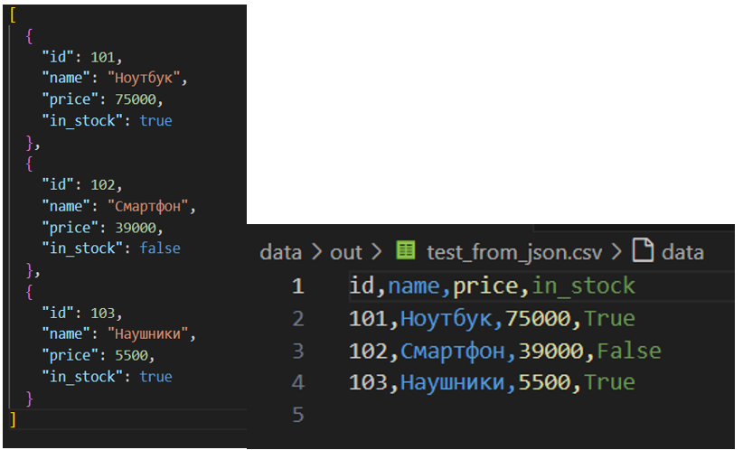
### csv_xlsx
```python
import csv
from pathlib import Path
from openpyxl import Workbook
from openpyxl.utils import get_column_letter

def csv_to_xlsx(csv_path: str, xlsx_path: str) -> None:
    csv_file=Path(csv_path)
    if not csv_file.exists():
        return FileNotFoundError("Файл не найден")
    if csv_file.suffix != '.csv':
        return ValueError("Неверный тип файла")
    wb=Workbook()
    ws=wb.active
    ws.title="Sheet1"

    with open(csv_path, 'r', encoding='utf-8') as f:
        reader= csv.DictReader(f)
        rows = list(reader)
    if len(rows)==0:
        return ValueError("Файл не содержит данных")
    if not reader.fieldnames:
        return ValueError("Файл не содержит заголовка")

    ws.append(reader.fieldnames)

    r_count=0
    for row in rows:
        r_count+=1

        data_for_ex=[]
        for title in reader.fieldnames:
            data_for_ex.append(row[title])
        ws.append(data_for_ex)
    if r_count == 0:
        return ValueError("Нет данных")


    for col_index in range(1,len(reader.fieldnames)+1):
        column_letter=get_column_letter(col_index)
        max_len=0
        for row in ws[column_letter]:
            if row.value is not None:
                max_len=max(max_len,len(str(row.value)))

        m_width=max(max_len+2, 8)
        ws.column_dimensions[column_letter].width =m_width
    xlsx_path = Path(xlsx_path)
    wb.save(xlsx_path)

csv_to_xlsx("data/samples/people.csv","data/out/people.xlsx")
```

## Лабораторная работа 6

### cli_text
```python
import argparse
from pathlib import Path
from src.lib.text import tokenize, count_freq, top_n

def main():
    parser = argparse.ArgumentParser(description="CLI-утилиты лабораторной №6")
    subparsers=parser.add_subparsers(dest="command", help="Доступные соманды")

    stats_parser = subparsers.add_parser("stats",help="Частоты слов в тексте")
    stats_parser.add_argument("--input", required=True, help="Входной текстовый файл")
    stats_parser.add_argument("--top", type=int,default=5,help="Количество топовых слов "
    "(по умолчанию: 5)")

    cat_parser=subparsers.add_parser("cat", help="Вывод содержимого файла")
    cat_parser.add_argument("--input", required=True, help="Путь к входному файлу")
    cat_parser.add_argument("-n",action="store_true", help="Нумеровать строки")

    args = parser.parse_args()

    file=Path(args.input)

    if not file.exists():
        raise FileNotFoundError("Файл не найден")


    if args.command == "cat":

        with open(file, "r", encoding="utf-8") as f:
            number=1
            for row in f:
                row = row.rstrip("\n")
                if args.n:
                    print(f"{number} : {row}")
                    number+=1
                else:
                    print(row)

    elif args.command == "stats":

        with open(file, "r", encoding="utf-8") as f:
            data=[row for row in f]
        data = "".join(data)
        tokens = tokenize(text=data)
        freq = count_freq(tokens=tokens)
        top=top_n(freq=freq, n = args.top)

        number=1
        for x, y in top:
            print(f"{number}. {x} - {y}")
            number+=1
if __name__ == "__main__":
    main()
```
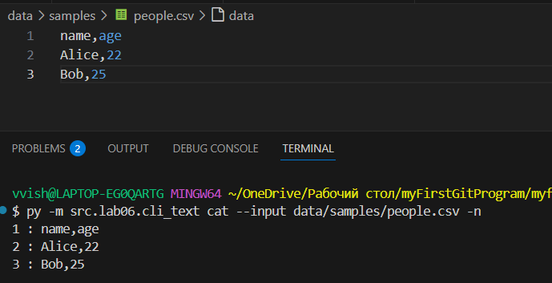
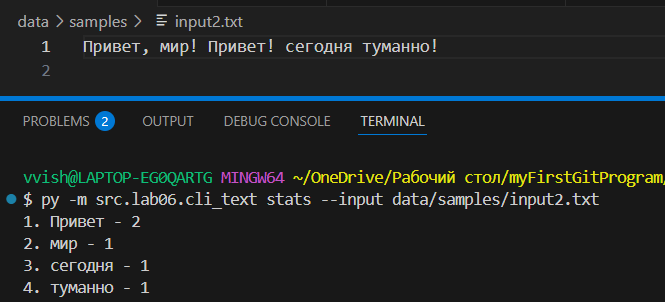
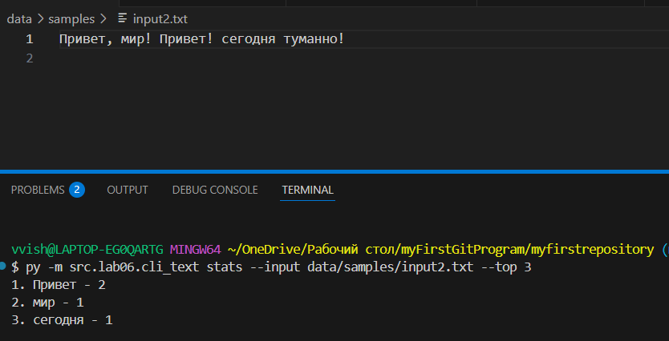
### cli_convert
```python
import argparse
from src.lib.json_csv import json_to_csv, csv_to_json
from src.lib.csv_xlsx import csv_to_xlsx

def main():
    parser = argparse.ArgumentParser(description="Конвертер данных между форматами")
    subparsers = parser.add_subparsers(dest="command", help="Доступные команды конвертации")

    json_to_csv_parser = subparsers.add_parser("json_to_csv", help="Конвертировать JSON в CSV")
    json_to_csv_parser.add_argument("--in", dest = "input", required= True, help="Входной JSON файл")
    json_to_csv_parser.add_argument("--out", dest = "output", required = True, help="Выходной CSV файл")


    csv_to_json_parser = subparsers.add_parser("csv_to_json", help="Конвертировать CSV в JSON")
    csv_to_json_parser.add_argument("--in", dest="input", required=True, help="Входной CSV файл")
    csv_to_json_parser.add_argument("--out", dest="output", required=True, help="Выходной JSON файл")

    csv_to_xlsx_parser = subparsers.add_parser("csv_to_xlsx", help="Конвертировать CSV в XLSX")
    csv_to_xlsx_parser.add_argument("--in", dest="input", required=True, help="Входной CSV файл")
    csv_to_xlsx_parser.add_argument("--out", dest="output", required=True, help="Выходной XLSX файл")

    args = parser.parse_args()

    if args.command == "json_to_csv":
        json_to_csv(json_path=args.input, csv_path=args.output)

    elif  args.command == "csv_to_json":
        csv_to_json(csv_path=args.input, json_path=args.output)

    elif args.command == "csv_to_xlsx":
        csv_to_xlsx(csv_path=args.input, xlsx_path=args.output)

if __name__ == "__main__":
    main()
```
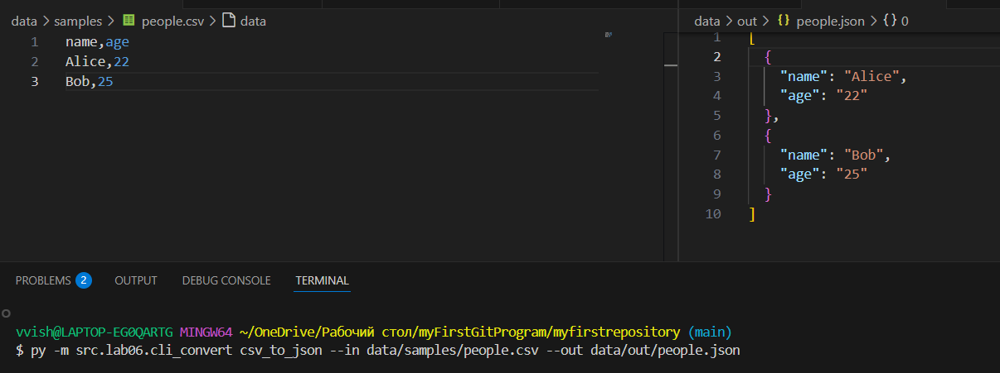

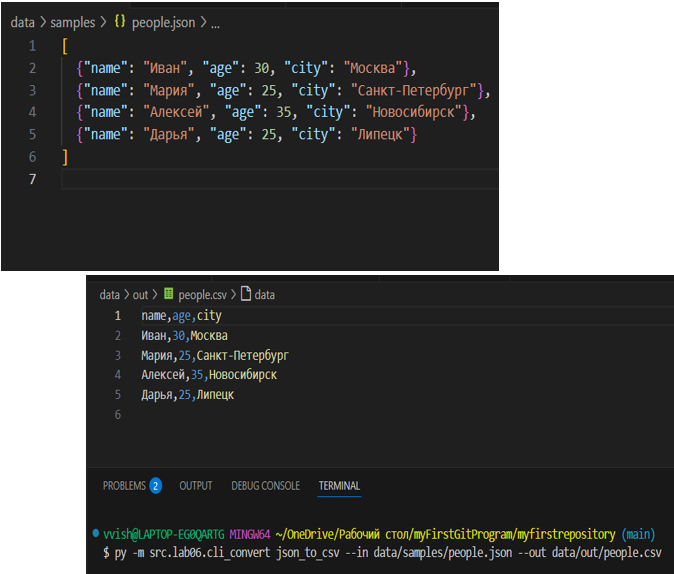
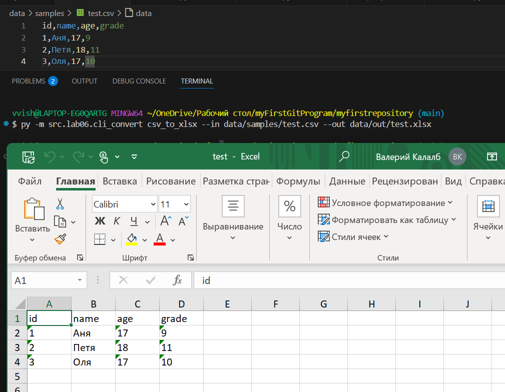
## Лабораторная работа 7

### test_text.py
```python
import pytest

from src.lib.text import count_freq, normalize, tokenize, top_n


@pytest.mark.parametrize(
    "src,expected",
    [
        ("ПрИвЕт\nМИр\t", "привет мир"),
        ("ёжик, Ёлка", "ежик, елка"),
        ("Hello\r\nWorld", "hello world"),
        ("  двойные   пробелы  ", "двойные пробелы"),
    ],
)
def test_normalize(src, expected):
    assert normalize(src) == expected


@pytest.mark.parametrize(
    "src,expected",
    [
        ("привет мир", ["привет", "мир"]),
        ("hello,world!!!", ["hello", "world"]),
        ("по-настоящему круто", ["по-настоящему", "круто"]),
        ("2025 год", ["2025", "год"]),
        ("emoji 😀 не слово", ["emoji", "не", "слово"]),
    ],
)
def test_tokenize(src, expected):
    assert tokenize(src) == expected


def test_count_and_top():
    tokens = ["a", "b", "a", "c", "b", "a"]
    freq = count_freq(tokens)
    assert freq == {"a": 3, "b": 2, "c": 1}
    assert top_n(freq, 2) == [("a", 3), ("b", 2)]


def test_top_tie_breaker():
    freq = count_freq(["bb", "aa", "bb", "aa", "cc"])
    assert top_n(freq, 2) == [("aa", 2), ("bb", 2)]


def test_dop():
    """Тесты для пустых входных данных"""
    assert normalize("") == ""
    assert tokenize("") == []
    assert count_freq([]) == {}
    assert top_n({}, 5) == []


def test_top_dop():
    """Запрос большего N чем есть элементов"""
    freq = {"a": 3, "b": 2}
    assert top_n(freq, 5) == [("a", 3), ("b", 2)]
```
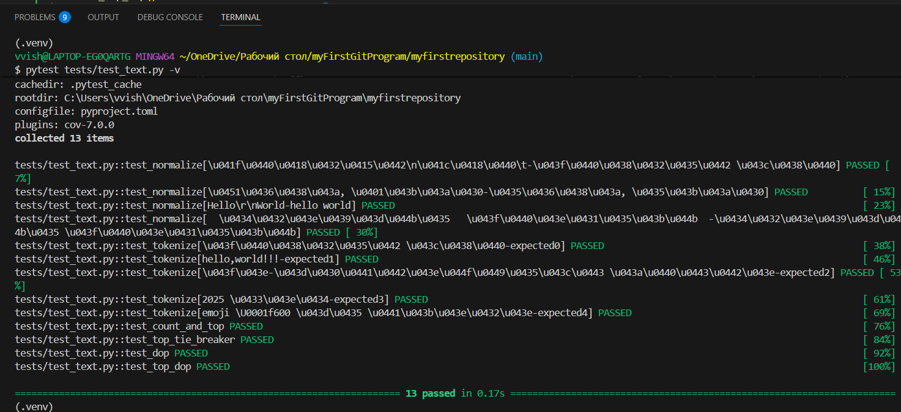

### test_json_csv.py
```python
import json, csv
from pathlib import Path
import pytest
from src.lab05.json_csv import json_to_csv
from src.lab05.csv_json import csv_to_json


def write_json(path: Path, obj):
    path.write_text(json.dumps(obj, ensure_ascii=False, indent=2), encoding="utf-8")

def read_csv_rows(path: Path):
    with path.open(encoding="utf-8") as f:
        return list(csv.DictReader(f))

def test_json_to_csv_roundtrip(tmp_path: Path):
    src = tmp_path / "people.json"
    dst = tmp_path / "people.csv"
    data = [{"name": "Alice", "age": 22}, {"name": "Bob", "age": 25}]
    write_json(src, data)

    json_to_csv(str(src), str(dst))
    rows = read_csv_rows(dst)
    assert len(rows) == 2
    assert set(rows[0]) >= {"name", "age"}

def test_csv_to_json_roundtrip(tmp_path: Path):
    src = tmp_path / "people.csv"
    dst = tmp_path / "people.json"
    src.write_text("name,age\nAlice,22\nBob,25\n", encoding="utf-8")

    csv_to_json(str(src), str(dst))
    obj = json.loads(dst.read_text(encoding="utf-8"))
    assert isinstance(obj, list) and len(obj) == 2
    assert set(obj[0]) == {"name", "age"}

def test_json_to_csv_empty(tmp_path: Path):
    """Тест для пустого JSON - ожидаем что функция обработает это корректно"""
    src = tmp_path / "empty.json"
    dst = tmp_path / "empty.csv"
    src.write_text("[]", encoding="utf-8")

    try:
        json_to_csv(str(src), str(dst))
        # Если функция выполнилась без ошибки, проверяем результат
        if dst.exists():
            # Файл создан - тест пройден
            pass
    except (ValueError, IndexError):
        pass

def test_csv_to_json_empty(tmp_path: Path):
    """Тест для пустого CSV - ожидаем что функция обработает это корректно"""
    src = tmp_path / "empty.csv"
    dst = tmp_path / "empty.json"
    src.write_text("", encoding="utf-8")

    try:
        csv_to_json(str(src), str(dst))
        # Если функция выполнилась без ошибки, проверяем результат
        if dst.exists():
            # Файл создан - тест пройден
            pass
    except (ValueError, Exception):
        pass

def test_missing_file(tmp_path: Path):
    """Тест для несуществующего файла"""
    try:
        csv_to_json("nope.csv", str(tmp_path / "out.json"))
        # Если функция выполнилась, проверяем результат
        if (tmp_path / "out.json").exists():
            # Файл создан - тест пройден
            pass
    except FileNotFoundError:
        pass
```
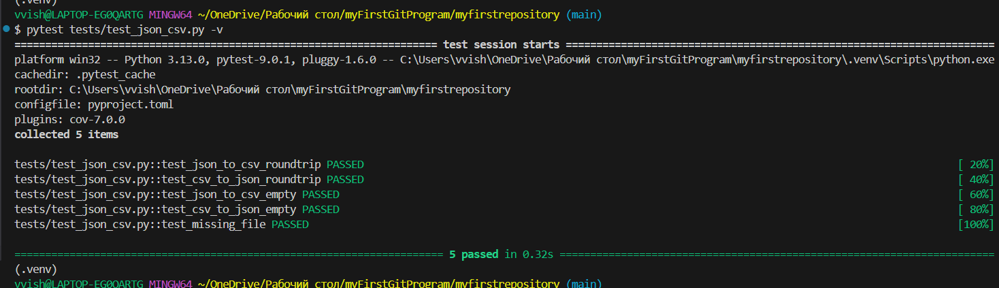
### black

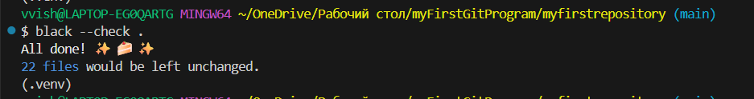

## Лабораторная работа 8

### models.py
```python
from datetime import datetime, date
from dataclasses import dataclass
@dataclass
class Student:
    fio: str
    birthdate: str
    group: str
    gpa: float

    def __post_init__(self):
        #  Валидация birthdate
        try:
            datetime.strptime(self.birthdate, "%Y-%m-%d")
        except ValueError:
            raise ValueError(f"Неверный формат даты: {self.birthdate}. Ожидается YYYY-MM-DD")

        #  Валидация GPA
        if not (0 <= self.gpa <= 5):
            raise ValueError(f"GPA должен быть в диапазоне 0..5, получено: {self.gpa}")

    # Возраст студента
    def age(self) -> int:
        birth = datetime.strptime(self.birthdate, "%Y-%m-%d").date()
        today = date.today()
        years = today.year - birth.year
        if (today.month, today.day) < (birth.month, birth.day):
            years -= 1
        return years
    # Сериализация
    def to_dict(self) -> dict:
        return {
            "fio": self.fio,
            "birthdate": self.birthdate,
            "group": self.group,
            "gpa": self.gpa
        }


    # Десериализация

    @classmethod
    def from_dict(cls, d: dict):
        return cls(
            fio=d["fio"],
            birthdate=d["birthdate"],
            group=d["group"],
            gpa=d["gpa"]
        )

    def __str__(self):
        return f"{self.fio} ({self.group}), возраст: {self.age()}, GPA: {self.gpa}"


```
### serialize.py
```python
import json
from .models import Student
def students_to_json(students, path):
    "Сохранение списка студентов в JSON файл."
    data = [s.to_dict() for s in students]

    with open(path, "w", encoding="utf-8") as f:
        json.dump(data, f, ensure_ascii=False, indent=4)

def students_from_json(path) -> list[Student]:
    "Загрузка студентов из JSON файла."
    with open(path, "r", encoding="utf-8") as f:
        raw = json.load(f)

    result = []
    for d in raw:
        result.append(Student.from_dict(d))

    return result
```
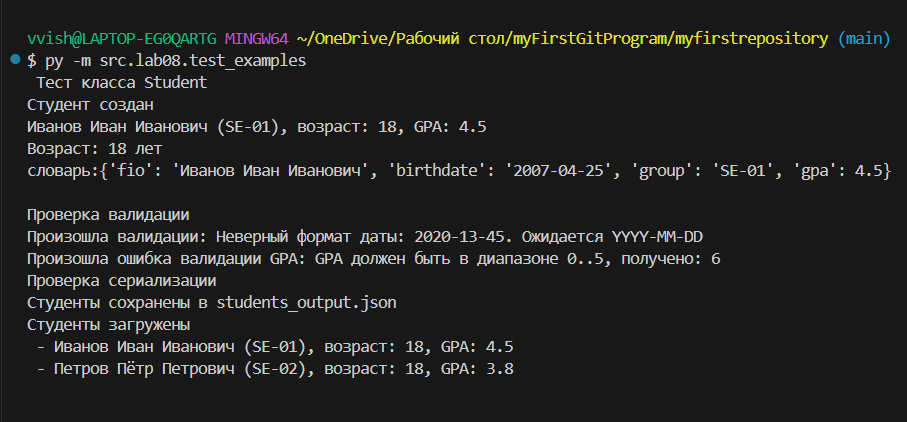
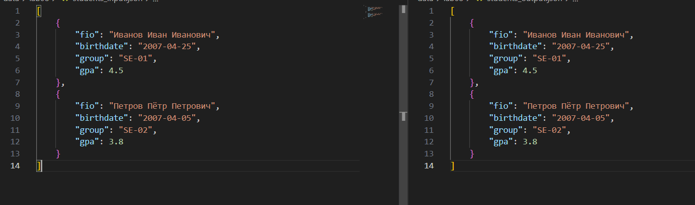
## Лабораторная работа 9
### group.py
```python
import csv
from pathlib import Path
from src.lab08.models import Student

class Group:
    def __init__(self, storage_path: str):
        self.path = Path(storage_path)
        self._ensure_storage_exists()

    def _ensure_storage_exists(self):
        "Создаёт CSV-файл с заголовком, если его нет."
        if not self.path.exists():
            self.path.parent.mkdir(parents=True, exist_ok=True)
            with self.path.open("w", encoding="utf-8", newline="") as f:
                writer = csv.writer(f)
                writer.writerow(["fio", "birthdate", "group", "gpa"])

    def _read_all(self):
        "Читает все строки CSV как список словарей."
        rows = []
        with self.path.open("r", encoding="utf-8", newline="") as f:
            reader = csv.DictReader(f)
            if reader.fieldnames != ["fio", "birthdate", "group", "gpa"]:
                raise ValueError("Неверный заголовок CSV-файла")
            for row in reader:
                if not any(row.values()):
                    continue
                rows.append(row)
        return rows

    def _write_all(self, rows):
        "Перезаписывает CSV полностью."
        with self.path.open("w", encoding="utf-8", newline="") as f:
            writer = csv.DictWriter(f, fieldnames=["fio", "birthdate", "group", "gpa"])
            writer.writeheader()
            for r in rows:
                writer.writerow(r)
    def list(self):
        "Возвращает список Student."
        rows = self._read_all()
        students = []
        for r in rows:
            r2 = {
                "fio": r["fio"],
                "birthdate": r["birthdate"],
                "group": r["group"],
                "gpa": float(r["gpa"])
            }
            students.append(Student.from_dict(r2))
        return students

    def add(self, student: Student):
        "Добавить студента в CSV."
        rows = self._read_all()
        row = student.to_dict()
        row["gpa"] = str(row["gpa"])
        rows.append(row)
        self._write_all(rows)

    def find(self, substr: str):
        "Поиск по подстроке в ФИО (без учета регистра)."
        rows = self._read_all()
        substr = substr.lower()
        found = []
        for r in rows:
            if substr in r["fio"].lower():
                r2 = {
                    "fio": r["fio"],
                    "birthdate": r["birthdate"],
                    "group": r["group"],
                    "gpa": float(r["gpa"])
                }
                found.append(Student.from_dict(r2))
        return found

    def remove(self, fio: str):
        "Удаляет запись по точному ФИО. Возвращает количество удалённых."
        rows = self._read_all()
        new_rows = [r for r in rows if r["fio"] != fio]
        removed = len(rows) - len(new_rows)

        if removed:
            self._write_all(new_rows)

        return removed
    def update(self, fio: str, **fields):

        rows = self._read_all()

        for r in rows:
            if r["fio"] == fio:
                r.update({k: str(v) for k, v in fields.items()})

        self._write_all(rows)

```
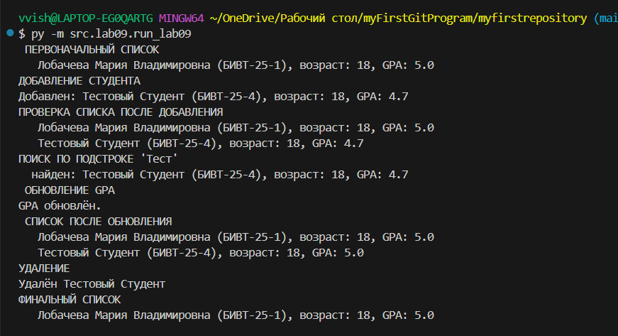
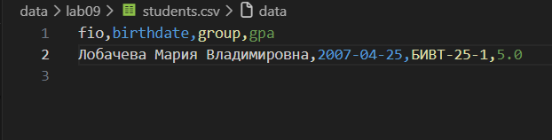
## Лабораторная работа 10
### structures.py
```python
from collections import deque


class Stack:
    "Класс стека (LIFO) на основе списка"

    def __init__(self):
        self._data = []  # внутренняя структура

    def push(self, item):
        "Добавить элемент в стек"
        self._data.append(item)

    def pop(self):
        "Снять элемент с вершины стека"
        if self.is_empty():
            raise IndexError("pop from empty stack")
        return self._data.pop()

    def peek(self):
        "Посмотреть верхний элемент без удаления"
        if self.is_empty():
            return None
        return self._data[-1]

    def is_empty(self) -> bool:
        "True если стек пуст"
        return len(self._data) == 0

    def __len__(self):
        return len(self._data)

    def __repr__(self):
        return f"Stack({self._data})"


class Queue:
    "Класс очереди (FIFO) на основе deque"

    def __init__(self):
        self._data = deque()

    def enqueue(self, item):
        "Добавить в конец очереди"
        self._data.append(item)

    def dequeue(self):
        "Удалить первый элемент очереди"
        if self.is_empty():
            raise IndexError("dequeue from empty queue")
        return self._data.popleft()

    def peek(self):
        "Посмотреть первый элемент без удаления"
        if self.is_empty():
            return None
        return self._data[0]

    def is_empty(self) -> bool:
        return len(self._data) == 0

    def __len__(self):
        return len(self._data)

    def __repr__(self):
        return f"Queue({list(self._data)})"
```
### linked_list.py
```python
class Node:
    "Узел односвязного списка"

    def __init__(self, value, next=None):
        self.value = value
        self.next = next

    def __repr__(self):
        return f"Node({self.value})"


class SinglyLinkedList:
    "Односвязный список"

    def __init__(self):
        self.head = None
        self._size = 0

    def append(self, value):
        "Вставить в конец"
        new_node = Node(value)

        if self.head is None:
            self.head = self.tail = new_node
        else:
            self.tail.next = new_node
            self.tail = new_node

        self._size += 1

    def prepend(self, value):
        "Вставить в начало"
        new_node = Node(value, self.head)
        self.head = new_node
        if self._size == 0:
            self.tail = new_node
        self._size += 1

    def insert(self, idx: int, value):
        "Вставка по индексу"
        if idx < 0 or idx > self._size:
            raise IndexError("index out of range")

        if idx == 0:
            self.prepend(value)
            return

        if idx == self._size:
            self.append(value)
            return

        current = self.head
        for _ in range(idx - 1):
            current = current.next

        new_node = Node(value, current.next)
        current.next = new_node
        self._size += 1

    def remove_at(self, idx: int):
        "Удаление по индексу"
        if idx < 0 or idx >= self._size:
            raise IndexError("index out of range")

        if idx == 0:
            self.head = self.head.next
            if self._size == 1:
                self.tail = None
            self._size -= 1
            return

        current = self.head
        for _ in range(idx - 1):
            current = current.next

        current.next = current.next.next
        if idx == self._size - 1:
            self.tail = current

        self._size -= 1

    def __iter__(self):
        cur = self.head
        while cur:
            yield cur.value
            cur = cur.next

    def __len__(self):
        return self._size

    def __repr__(self):
        return f"SinglyLinkedList({list(self)})"
```
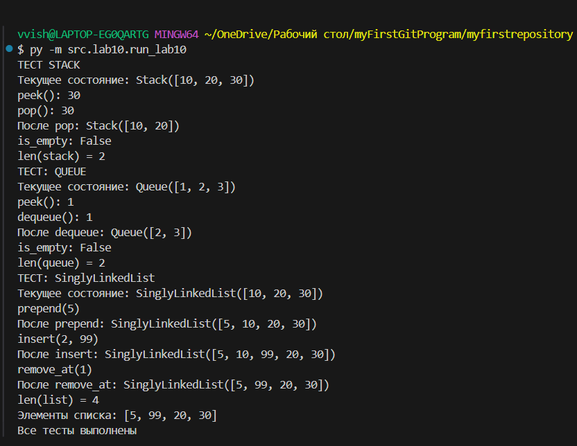
