# Лабораторные работы

## Лабораторная работа 1

### Задание 1
```python
ime=input('Имя: ')
vozrast=int(input('Возраст: '))
print(f'Привет, {ime}! Через год тебе будет {vozrast+1}.')
```


### Задание 2
```python
a=(input('Число a: ')).replace(',','.')
b=(input('Число b: ')).replace(',','.')
sum=round((float(a)+float(b)),2)
avg=round((float(a)+float(b))/2,2)
print(f'Сумма = {sum} ; Среднее арифметическое = {avg}')
```
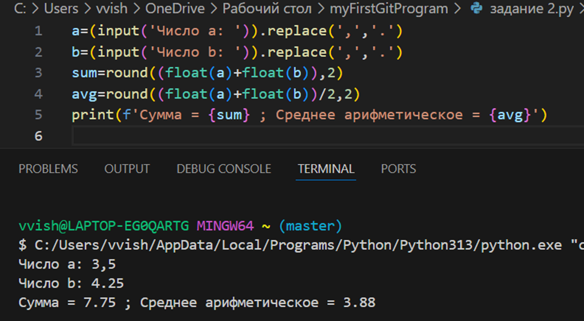


### Задание 3
```python
price = float(input('Введите цену: '))
disc = float(input('Введите скидку: '))
vat = float(input('Введите НДС: '))
base = price * (1 - disc / 100)
vat_amount =base * (vat / 100)
total = base + vat_amount
print(f'База после скидки:{base:.2f} Р')
print(f'НДС:{vat_amount:.2f} Р')
print(f'Итого к оплате:{total:.2f} Р')
```
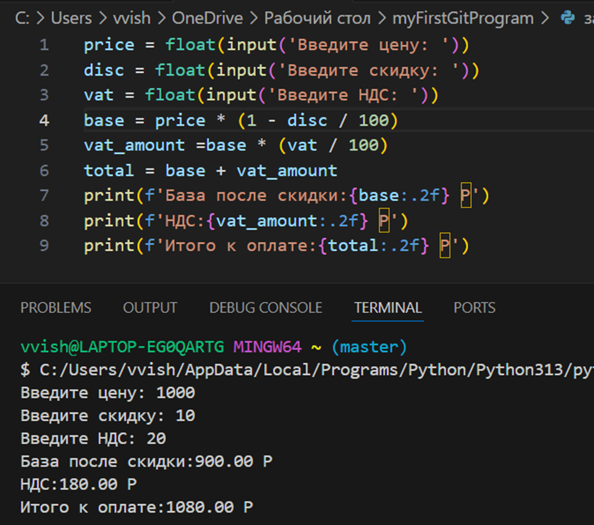

### Задание 4
```python
vrema=int(input('Введите кол-во минут '))
chas=vrema//60
print(f' Результат перевода: {chas}:{vrema-(chas*60)}')
```
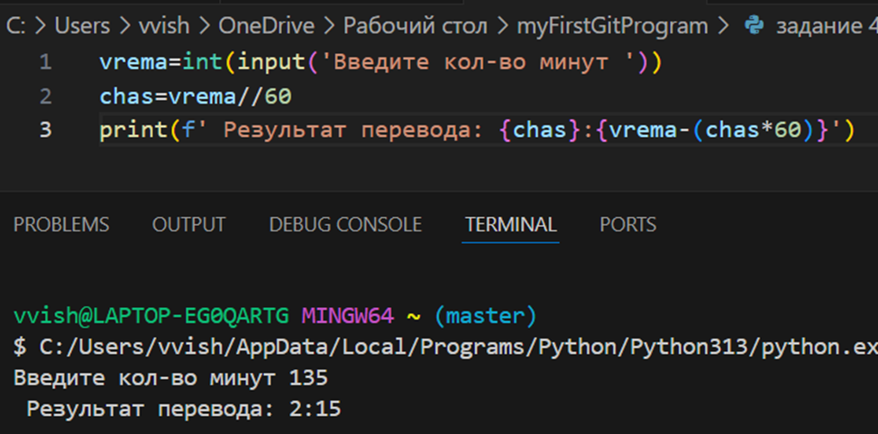

### Задание 5
```python
fio=input('ФИО: ')
inic=''
dl=0
x=fio.split()
for i in range(0,len(x)):
    inic=inic+x[i][0]+'.'
    dl=len(x[i])+dl
print(f'Инициалы: {inic[:-1]}')
print(f'Длина (символов): {dl+2}')
```
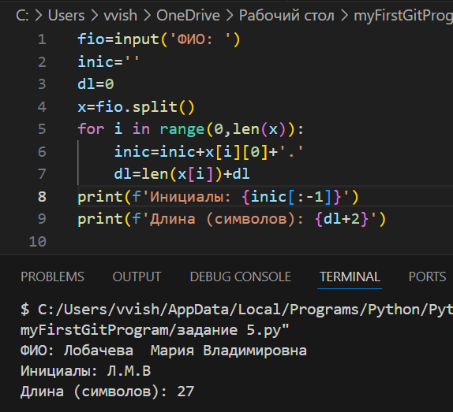
## Лабораторная работа 2
### Задание 1.1
```python
def min_max(nums:list[float|int])->tuple[float|int, float| int]:
    if len(nums)==0:
         return ValueError
    mi=100000000000000000
    ma=-100000000000000000
    for i in range(0,len(nums)):
        if nums[i]<mi:
            mi=nums[i]
        if nums[i]>ma:
            ma=nums[i]
    return tuple([mi, ma])
print(min_max([1.5, 2, 2.0, -3.1]))
```
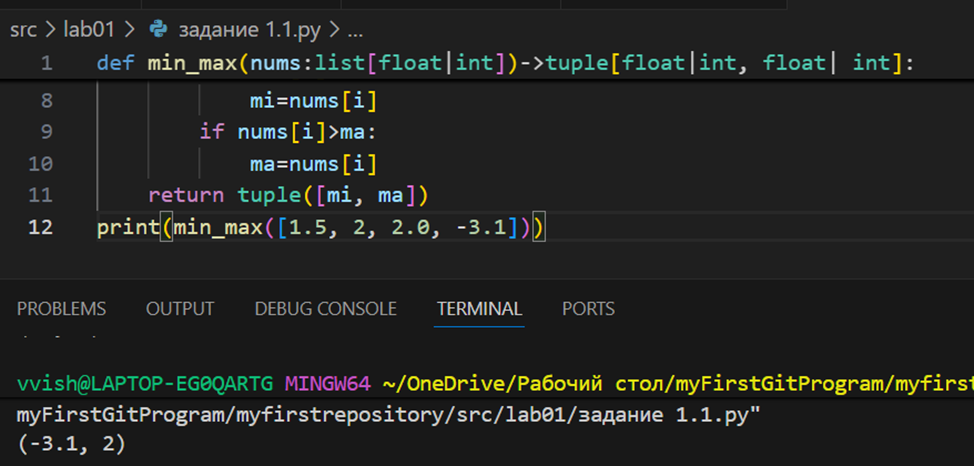

### Задание 1.2
```python
def unique_sorted(nums:list[float|int])->list[float|int]:
    return sorted(set(nums))
print(unique_sorted([3,1,2,1,3]))
```
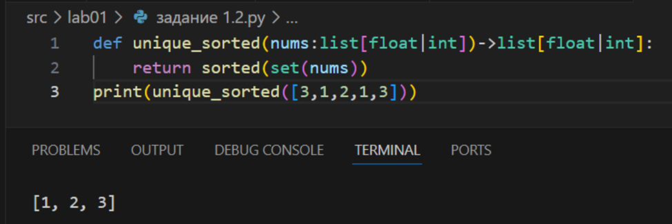

### Задание 1.3
```python
def flatten(mat:list[list| tuple])->list:
    array=list()
    for arr in mat:
        if not(isinstance(arr,tuple) or isinstance(arr,list)):
            return TypeError
        for member in arr:
            array.append(member)
    return array
print(flatten([[1,2],[3,4]]))
```
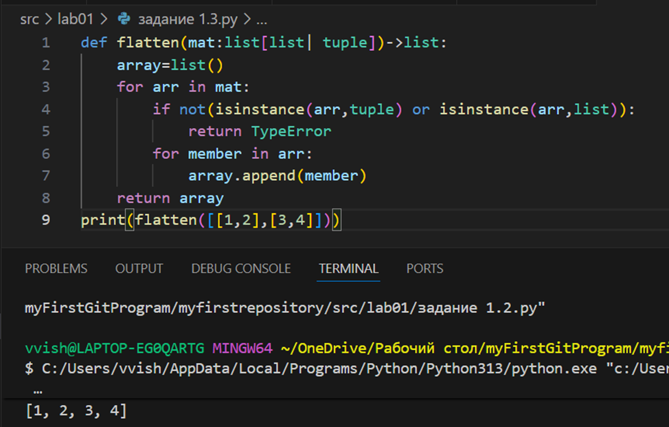

### Задание B.1
```python
def transpose(mat:list[list[float|int]])->list[list]:
    if len(mat)==0:
        return []
    if any(len(mat[0])!=len(mat[i]) for i in range(len(mat))):
        return ValueError
    new=[[0 for j in range(len(mat))] for i in range(len(mat[0]))]
    for i in range(len(mat)):
        for j in range(len(mat[i])):
            new[j][i]=mat[i][j]
    return new
print(transpose([[1,2],[3,4]]))
```
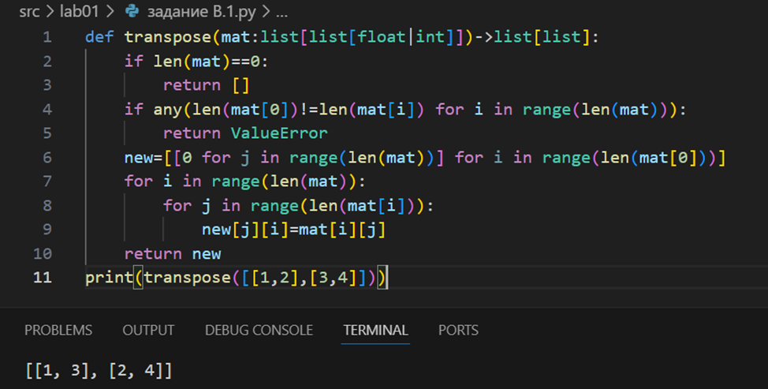

### Задание B.2
```python
def row_sums(mat:list[list[float|int]])->list[float]:
    if any(len(mat[0]) != len(mat[i]) for i in range(len(mat))):
        return ValueError
    array=list()
    for arr in mat:
        array.append(sum(arr))
    return array
print(row_sums([[1,2,3], [4,5,6]]))
```
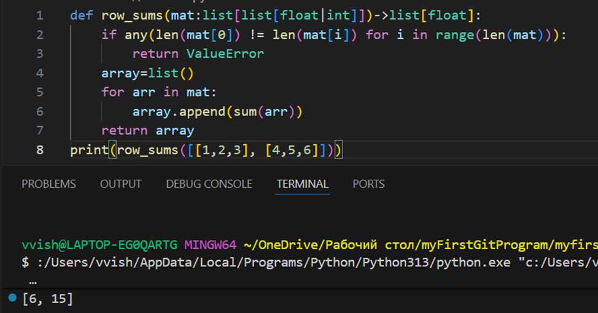

### Задание B.3
```python
def col_sums(mat:list[list[float|int]])->list[float]:
    if any (len(mat[0])!=len(mat[i]) for i in range (len(mat))):
        return ValueError
    array=list(0 for i in range(len(mat[0])))
    for i in range(len(mat)):
        for j in range(len(mat[i])):
            array[j]+=mat[i][j]
    return array
print(col_sums([[1,2,3],[4,5,6]]))
```
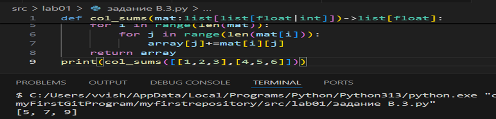

### Задание C
```python
def format_record(rec:tuple[str,str,float]):
    name_data=rec[0].strip().split()
    if len(name_data)>2:
        surname,name,otchestvo=rec[0].strip().split()
        new_name_data=f'{surname[0].upper()}{surname[1:]} {name[0].upper()} {otchestvo[0].upper()}'
    elif len(name_data)==2:
        surname, name = rec[0].strip().split()
        new_name_data = f'{surname[0].upper()}{surname[1:]} {name[0].upper()} '
    elif len(name_data)==1:
        surname,  = rec[0].strip().split()
        new_name_data = f'{surname[0].upper()}{surname[1:]} '
    else:
        return ValueError
    group=rec[1].strip()
    if group=='':
        return ValueError
    try:
        gpa=float(rec[2])
    except Exception as _:
        return TypeError
    return f'{new_name_data}, гр. {group}, GPA {gpa:.2f}'
print(format_record(("Петров Пётр Петрович", "IKBO-12", 5.0)))

```
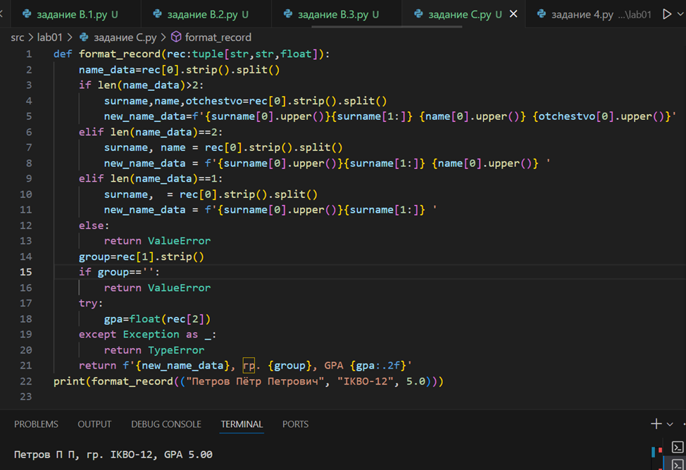
## Лабораторная работа 3

### Задание А
```python
import re

def normalize(text: str, *, casefold: bool = True, yo2e: bool = True) -> str:
    if casefold:
        text = text.casefold()
    if yo2e:
        text = text.replace('Ё', 'Е').replace('ё', 'е')
    text = ' '.join(text.strip().split())
    return text
print(normalize("Hello\r\nWorld"))
print(normalize("ёжик, Ёлка"))
print(normalize("Hello\r\nWorld"))
print(normalize("  двойные   пробелы  "))

def tokenize(text: str) -> list[str]:
    pattern = r'\w+(?:-\w+)*'
    tokens = re.findall(pattern, text)
    return tokens
print(tokenize("привет мир"))
print(tokenize("hello,world!!!"))
print(tokenize("по-настоящему круто"))
print(tokenize("2025 год"))
print(tokenize("emoji 😀 не слово"))
def count_freq(tokens: list[str]) -> dict[str, int]:
    freq = {}
    for token in tokens:
        freq[token] = freq.get(token, 0) + 1
    return freq

def top_n(freq: dict[str, int], n: int = 5) -> list[tuple[str, int]]:
    sorted_items = sorted(
        freq.items(),
        key=lambda x: (-x[1], x[0])
    )
    return sorted_items[:n]
print(top_n(count_freq(["a","b","a","c","b","a"]),n=2))
print(top_n(count_freq(["bb","aa","bb","aa","cc"]),n=2))
```
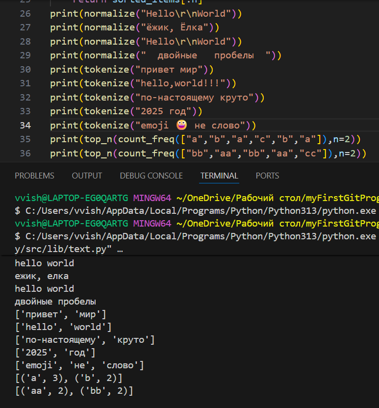

### Задание В
```
import sys
import os
sys.path.append(os.path.join(os.path.dirname(__file__), '..'))

from lib.text import normalize, tokenize, count_freq, top_n

# Чтение всего ввода из stdin
text = sys.stdin.readline()

# Нормализация текста
normalized_text = normalize(text)

# Токенизация
tokens = tokenize(normalized_text)

# Подсчет статистики
total_words = len(tokens)
freq_dict = count_freq(tokens)
unique_words = len(freq_dict)
top_words = top_n(freq_dict, 5)

# Вывод результатов
print(f"Всего слов: {total_words}")
print(f"Уникальных слов: {unique_words}")
print("Топ-5:")

for word, count in top_words:
    print(f"{word}:{count}")
```
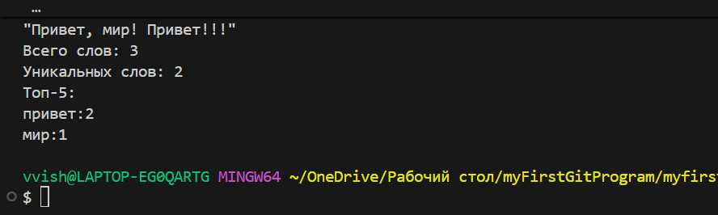
## Лабораторная работа 4

### io_txt_csv
```python
import csv
from pathlib import Path
from typing import Iterable, Sequence
from collections import Counter
import sys
import os

sys.path.append(os.path.join(os.path.dirname(__file__), '..'))

from lib.text import normalize, tokenize, count_freq, top_n

def read_text(path: str | Path, encoding: str = "utf-8") -> str:
    """Функция считывает текстовый файл и возвращает строку"""
    p = Path(path)
    # FileNotFoundError и UnicodeDecodeError пусть «всплывают» — это нормально
    return p.read_text(encoding=encoding)

def write_csv(rows: Iterable[Sequence], path: str | Path,
              header: tuple[str, ...] | None = None) -> None:
    """Функция создает cvs файл"""
    p = Path(path)
    rows = list(rows)
    with p.open("w", newline="", encoding="utf-8") as f:
        w = csv.writer(f)
        if header is not None:
            w.writerow(header)
        for r in rows:
            w.writerow(r)

def frequencies_from_text(text: str) -> dict[str, int]:
    """Функция возврашает словарь: слово - частота """
    tokens = tokenize(normalize(text))
    return Counter(tokens)  # dict-like

def sorted_word_counts(freq: dict[str, int]) -> list[tuple[str, int]]:
    """Сортировка по убыванию частоты"""
    return sorted(freq.items(), key=lambda kv: (-kv[1], kv[0]))
```
### text_report
```python
import sys
import os
from pathlib import Path
sys.path.append(os.path.join(os.path.dirname(__file__), '..'))

from lab04.io_txt_csv import read_text, write_csv,sorted_word_counts,frequencies_from_text
from lib.text import summary

def main():
    try:
      content = read_text("./data/input.txt")
      if not content.strip():
          print("Файл пуст")
          write_csv([], "./data/report.csv", header=("word", "count"))
      else:
          print (summary(content))
          content = write_csv(sorted_word_counts(frequencies_from_text(content)),"./data/report.csv", header=("word", "freq") )
      print ()
    except FileNotFoundError as e:
        print(f"Ошибка: Файл не найден - {e}")
    except UnicodeDecodeError:
        print("Ошибка: Проблема с кодировкой файла!")
    except Exception as e:
        print(f"Произошла ошибка: {e}")

if __name__ == "__main__":
    main()
```
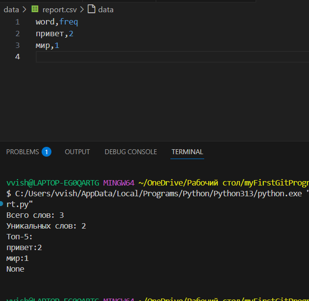
## Лабораторная работа 5

### csv_json
```python
import json
import csv
from pathlib import Path


def csv_to_json(csv_path: str, json_path: str) -> None:
    file_csv=Path(csv_path)

    if not file_csv.exists():
        return FileNotFoundError("Файл не найден")

    if file_csv.suffix != ".csv":
        return ValueError("Неверный тип данных")

    with open(file_csv, "r", encoding='utf-8') as f:
        reader=csv.DictReader(f)

        if reader.fieldnames is None:
            return ValueError("Отсутствуют заголовки в файле")
        dano=list(reader)
    if len(dano)==0:
        return ValueError("Пустой файл")

    with open(json_path, "w", encoding='utf-8') as f:
        json.dump(dano, f, ensure_ascii=False, indent=2)
csv_to_json("data/samples/test.csv","data/out/test_from_csv.json.json")
```
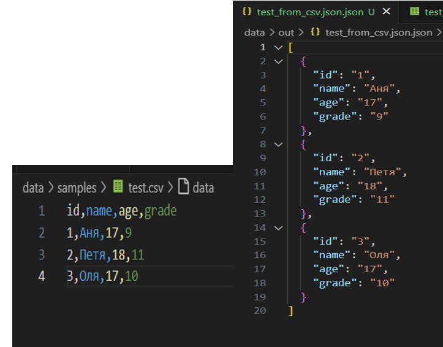
### json_csv
```python
import json
import csv
from pathlib import Path

def json_to_csv(json_path: str, csv_path: str) -> None:
    file_json=Path(json_path)

    if not file_json.exists():
        return FileNotFoundError("файл не найден")

    try:
        with file_json.open('r',encoding='utf-8') as f:
            dano=json.load(f)
    except json.JSONDecodeError:
        return ValueError("неподдерживаемая структура")

    except not isinstance(dano,list):
        return ValueError("JSON должен быть быть в виде списка объектов")

    except len(dano)==0:
        return ValueError("JSON файл пуст")

    except not all(isinstance(item, dict) for item in dano):
        return ValueError("Каждый элемент JSON должны быть словарями")

    with open(csv_path, 'w', newline='', encoding='utf-8') as f:
            writer = csv.DictWriter(f, fieldnames=tuple(dano[0].keys()))
            writer.writeheader()
            writer.writerows(dano)
json_to_csv("data/samples/test.json","data/out/test_from_json.csv")
```

### csv_xlsx
```python
import csv
from pathlib import Path
from openpyxl import Workbook
from openpyxl.utils import get_column_letter

def csv_to_xlsx(csv_path: str, xlsx_path: str) -> None:
    csv_file=Path(csv_path)
    if not csv_file.exists():
        return FileNotFoundError("Файл не найден")
    if csv_file.suffix != '.csv':
        return ValueError("Неверный тип файла")
    wb=Workbook()
    ws=wb.active
    ws.title="Sheet1"

    with open(csv_path, 'r', encoding='utf-8') as f:
        reader= csv.DictReader(f)
        rows = list(reader)
    if len(rows)==0:
        return ValueError("Файл не содержит данных")
    if not reader.fieldnames:
        return ValueError("Файл не содержит заголовка")

    ws.append(reader.fieldnames)

    r_count=0
    for row in rows:
        r_count+=1

        data_for_ex=[]
        for title in reader.fieldnames:
            data_for_ex.append(row[title])
        ws.append(data_for_ex)
    if r_count == 0:
        return ValueError("Нет данных")


    for col_index in range(1,len(reader.fieldnames)+1):
        column_letter=get_column_letter(col_index)
        max_len=0
        for row in ws[column_letter]:
            if row.value is not None:
                max_len=max(max_len,len(str(row.value)))

        m_width=max(max_len+2, 8)
        ws.column_dimensions[column_letter].width =m_width
    xlsx_path = Path(xlsx_path)
    wb.save(xlsx_path)

csv_to_xlsx("data/samples/people.csv","data/out/people.xlsx")
```
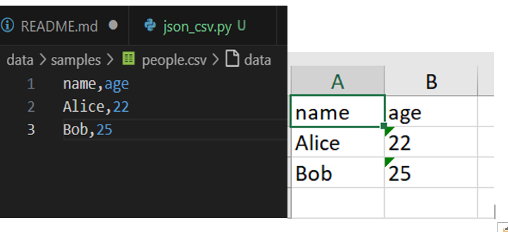
